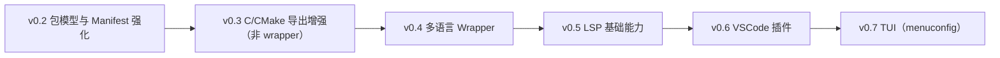

# Rconfig

Rconfig 是一个面向配置场景的声明式 DSL 工具链，目标是提供类似 Kconfig 的建模体验，
同时保持可组合的语义分析、结构化诊断与可预测导出能力。

当前仓库包含两部分：

- `rcfg`：CLI 工具（`check` / `export` / `dump` / `i18n extract`）
- `rcfg-lang`：语言核心库（词法、语法、语义、求解、导出）

## 快速开始

### 1) 校验配置

```bash
rcfg check --schema schema.rcfg --values profile.rcfgv
```

### 2) 导出构建产物

```bash
rcfg export \
  --schema schema.rcfg \
  --values profile.rcfgv \
  --out-h build/config.h \
  --out-cmake build/config.cmake
```

### 3) 导出求解结果与调试信息

```bash
rcfg dump \
  --schema schema.rcfg \
  --values profile.rcfgv \
  --out build/resolved.json \
  --out-schema-ir build/schema_ir.json \
  --out-diagnostics build/diagnostics.json
```

### 4) 生成 i18n 模板

```bash
rcfg i18n extract \
  --schema schema.rcfg \
  --locale zh-CN \
  --out i18n/zh-CN.toml
```

## 仓库结构

- `src/`：CLI 主程序与命令实现
- `crates/rcfg-lang/`：语言核心库
- `tests/`：CLI 集成测试
- `docs/`：用户与开发文档（简体中文）
- `_prd/`：需求与阶段规划文档（内部）

## 文档导航

- [5 分钟上手](docs/quickstart.md)
- [CLI 命令手册](docs/cli.md)
- [DSL 语法与语义](docs/dsl.md)
- [架构与模块职责](docs/architecture.md)
- [开发与贡献指南](docs/development.md)

## 贡献与开发

- 推荐先阅读 `docs/development.md`
- 变更前后请执行：

```bash
cargo check --workspace --all-targets
cargo test --workspace
```

## Roadmap（v0.2 ~ v0.7）

> 暂不定义 v1.0，先按能力版本迭代。




- v0.2：`dependencies`/path 依赖最小闭环，多包命名空间基础
- v0.3：导出器可配置性、稳定性、可集成性增强
- v0.4：统一 wrapper 接口抽象与首批语言绑定样例
- v0.5：实时诊断、补全、跳转、Hover 最小可用链路
- v0.6：基于 LSP 的 VSCode 集成与调试体验闭环
- v0.7：交互式配置浏览/编辑与约束即时反馈
## 许可证

本项目使用 Apache-2.0 许可证。
