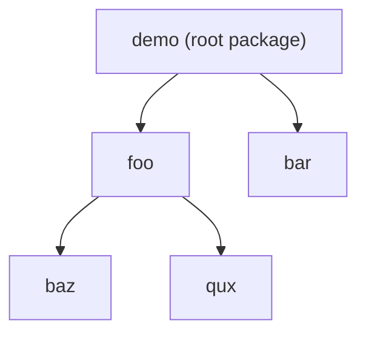
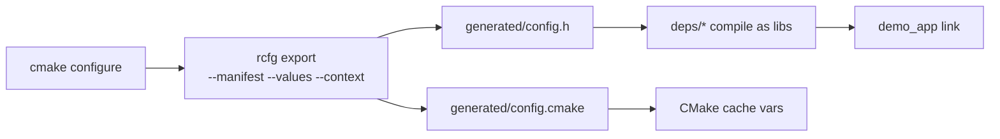
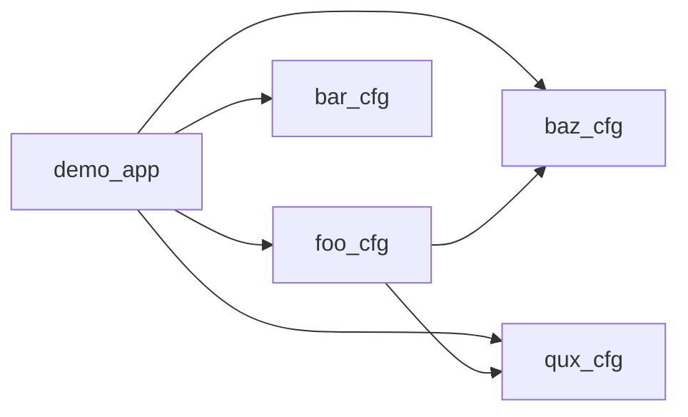

# C++ / CMake complex example (`foo/bar/baz/qux`)

This example demonstrates a relatively complex Rconfig project with a real multi-library C++ layout,
not only schema/values files.

## Package dependency graph (Rconfig)



## Build/export flow



## C++ target link graph



## Source layout (real code)

- `deps/baz`: lane/batch policy helpers (`baz_cfg`)
- `deps/qux`: format/environment helpers (`qux_cfg`)
- `deps/foo`: runtime profile logic, depends on `baz_cfg + qux_cfg` (`foo_cfg`)
- `deps/bar`: endpoint/queue policy (`bar_cfg`)
- `src/main.cpp`: links all libs and prints combined runtime summary

## What is intentionally covered

- Multi-package manifest graph (including transitive dependencies).
- Schema core grammar: `use/mod/enum/option/constraint/require!/when/match case if`.
- Expression coverage: `in` range/set, `len()`, `matches()`, logical + relational operators.
- Attributes: `#[range]`, `#[unit]`, `#[msg]`, `#[secret]`, `#[label_key]`, `#[help_key]`.
- Reserved grammar showcase: `#[cfg(true)]`, `export ... { ... }`.
- Patch semantics: `patch <target> { default ...; }`.
- Values features: `include "@root/..."`, `use ... as ...`, enum value assignment, `env("K", "fallback")`.
- CMake integration via `add_custom_command` + generated header/module include.
- Real C++ static libraries consuming generated `config.h` macros.

## Prerequisites

- `cmake >= 3.20`
- `rcfg` binary

If you are working in this repo, build once:

```bash
cargo build --bin rcfg
```

Then use `./target/debug/rcfg` as `RCFG_BIN`.

## Configure and build (dev profile)

```bash
cmake -S examples/cpp-cmake -B examples/cpp-cmake/build \
  -DRCFG_BIN="$(pwd)/target/debug/rcfg" \
  -DRCFG_PROFILE=dev

cmake --build examples/cpp-cmake/build
./examples/cpp-cmake/build/demo_app
```

## Configure and build (prod profile)

```bash
cmake -S examples/cpp-cmake -B examples/cpp-cmake/build-prod \
  -DRCFG_BIN="$(pwd)/target/debug/rcfg" \
  -DRCFG_PROFILE=prod

cmake --build examples/cpp-cmake/build-prod
./examples/cpp-cmake/build-prod/demo_app
```

## Run checks directly

```bash
./target/debug/rcfg check \
  --manifest examples/cpp-cmake/Config.toml \
  --values examples/cpp-cmake/profiles/dev.rcfgv \
  --context examples/cpp-cmake/context/dev.json
```

## Failing profiles for diagnostics demonstration

### 1) Range violation (`E_RANGE_VIOLATION`)

```bash
./target/debug/rcfg check \
  --manifest examples/cpp-cmake/Config.toml \
  --values examples/cpp-cmake/profiles/bad/range_violation.rcfgv \
  --context examples/cpp-cmake/context/dev.json \
  --format json
```

### 2) env parse failure (`E_ENV_PARSE_FAILED`)

```bash
./target/debug/rcfg check \
  --manifest examples/cpp-cmake/Config.toml \
  --values examples/cpp-cmake/profiles/bad/env_parse_failed.rcfgv \
  --context examples/cpp-cmake/context/dev.json \
  --format json
```

### 3) Inactive assignment under strict mode (`E_INACTIVE_ASSIGNMENT`)

```bash
./target/debug/rcfg check \
  --manifest examples/cpp-cmake/Config.toml \
  --values examples/cpp-cmake/profiles/bad/inactive_assignment.rcfgv \
  --context examples/cpp-cmake/context/windows.json \
  --strict \
  --format json
```

## Notes about reserved grammar in this example

- `#[cfg(true)]` and `export ... { ... }` are included to show syntax shape.
- Actual export behavior still primarily follows CLI export options.
